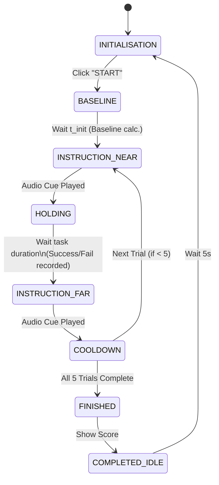
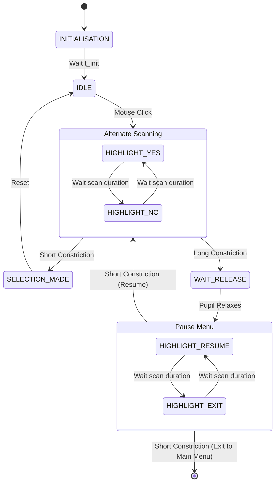
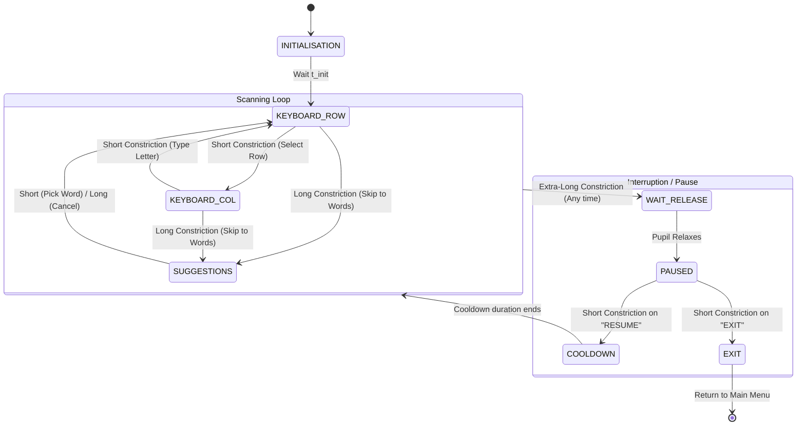
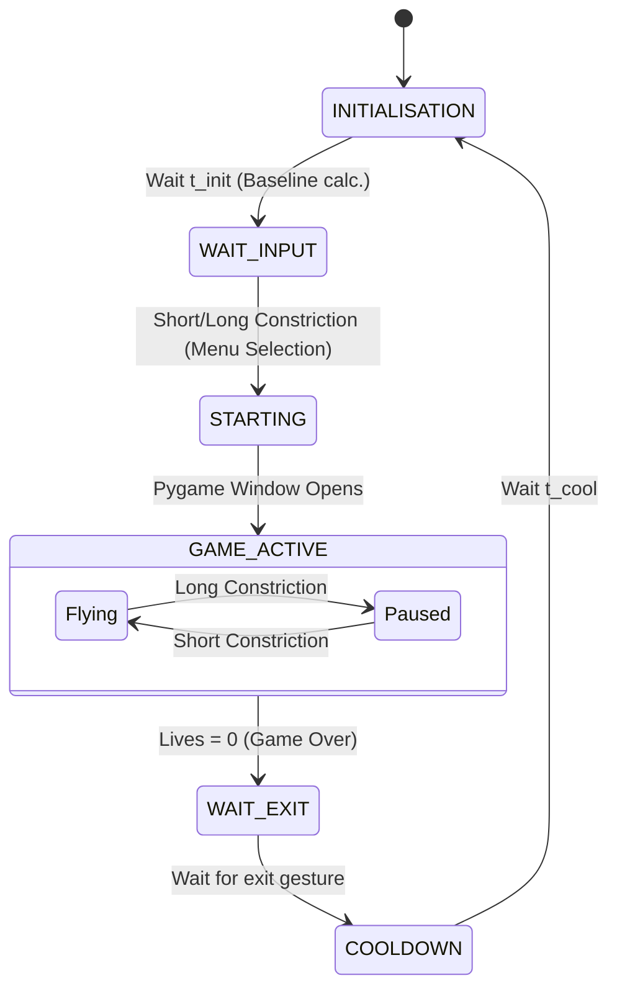

# _PUPIL-COM_ OFFICIAL DOCUMENTATION

This document provides a users manual for *Pupil-com* setup, from first installation to session initialisation and GUI navigation. Furthermore, it offers technical insights on the system's architecture and full state-machine diagrams for the core modules.

## Table of Contents
1. [Users guide](#1-users-guide)
   - [Installation and updates](#installation-updates)
   - [Hardware Setup](#hardware-setup)
   - [Session Initialisation](#session-initialisation)
   - [GUI Navigation](#GUI-navigation)
2. [System Architecture](#2-system-architecture)
3. [State Machines Diagrams](#3-state-machines-diagrams)
    - [Training Module](#training-module)
    - [Yes/No Module](#yes-no-module)
    - [Keyboard Module](#keyboard-module)
    - [Game Module (Space Shuttle)](#game-module)
4. [Data Logging and Output](#data-logging-and-output)
  
---

## 1. Users guide

### Installation and updates
_Pupil-com_ can be run either as a standalone application or directly from the source code.

- Standalone Application:
   1. Download the latest `.exe` release from the GitHub repository. No installation is required.
   2. Place the executable in a dedicated folder on your PC. Make sure the `credentials.json` file provided by the developer is in the same folder.
   3. **First-time setup:** On the very first launch, a browser window will pop up asking for Google Drive authorization. Log in with your Google account and grant permissions. A `token.json` file will be automatically generated in your folder to keep you logged in for future sessions.
   4. Updates are managed by downloading the latest `.exe` release and replacing the old executable in the same folder. Your tokens and settings will remain intact.
- Source Code: Ensure Python 3.8 (or above) is installed on your machine. Clone the repository and install all necessary dependencies by opening a terminal in the project directory and running pip install -r requirements.txt.

### Hardware Setup
The communication system design meets standard BCI requirements and integrates features specifically required for PAR performance and monitoring. The setup comprises the following elements:

- *Acquisition module*: The eye-tracking device (wearable or remote), performing live pupillometry and providing real-time data.

- *Computational unit*: The PC, receiving a live data stream from the acquisition module and running the program for the graphical user interface (GUI).

- *GUI display*: A monitor, showing a scanning-mode interface that the subject interacts with, and working as the far target.

- *Audio output*: External speakers to vocalise cues and selections within the GUI.

- *External input devices*: Mouse and keyboard for the initialisation of the GUI and fine-tuning of parameters by the researcher or caregiver.

- *Universal laboratory stand*: Holding the close target, a transparent plexiglass rectangle with a blue circular dot that the subject fixates their gaze on.

- *Seat*: For the subject to comfortably sit and maintain stillness while shifting their depth of focus.

_Pupil-com_ currently supports Pupil Core (wearable glasses) and Gazepoint GP3 (remote tripod-mounted tracker) as acquisition modules.

- Pupil Core: Place the headset on the user's face and connect the device to your PC via USB. Launch the native Pupil Capture software and ensure the eye camera is focused and properly detecting the pupil before enabling Pupil-com's Main Menu.

- Gazepoint GP3: Mount the tracker on its tripod and connect it via USB. Launch the Gazepoint Control software, and ensure the server is active before enabling Pupil-com's Main Menu.

### Session Initialisation
Run main.py script (or double click on the Pupil-com logo on the PC desktop):

A welcome dialog opens up: choose the eye-tracking device you are performing the acquisition on and type the subject's name, or press skip for an anonymous session.

Click the button "Avvia il dispositivo" at the bottom of the screen to start the acquisition via the eye-tracker.

The third-party application is initialised in an external window that shows the eye-tracking device's camera view. Adjust its position to ensure the user's pupils are correctly detected and the acquisition is stable over time.

Maximise the main menu window, make sure the pupillary area (message "Area registrata: ..." and digital eye in the top part of the screen) is being updated live. Click the green button "Dispositivo pronto" to start the scanning view. From now on, the GUI is fully in the user's control.

## Parameters
To adjust parameters according to the subject's needs and physiological response, click the three dots in the upper right corner, to open the settings dialog.

Here, you can adjust the threshold value, commands duration, scanning times and application-specific parameters.

## User navigation
All the GUI commands are based on a voluntary pupillary constriction (PAR):
- a short PAR (duration < 3 s);
- a long PAR (duration > 3 s and < 5 s);
- an extra-long PAR (duration > 5 s).

### MAIN MENU 
The main menu features four applications. The user must select their choice by performing a PAR when the respective button is highlighted.

### TRAINING
It consists of a guided exercise to familiarise with PAR elicitation, settle the most suitable threshold for the subject and make sure the algorithm is correctly detecting constrictions.
Five consecutive PARs are requested by the system and the score is shown at the end, along with a graph of the pupillary area and the instants PAR events were detected.

### SI O NO 
The application is a simple binary interface to ask yes/no questions. The external supervisor must ask the question and click a random point on the screen to start the answers scanner mode.
The user may answer the question by selecting their choice when highlighted with a short PAR. 

The pause and exit menu is accessible with a long PAR, and the user must choose between "Resume" and "Exit" with a short PAR when the preferred option is highlighted.

### TASTIERA
The application is a typing machine with predictive suggestions. The alternate scanner highlights one full row at a time, until the user performs a short PAR to select the current highlight.
Then, the keys in that specific row are highlighted one at a time, and the user must choose the desired character with another short PAR. Each character entry updates the predictive suggestions in the upper part of the keyboard, offering three options for the user to type faster. The user must perform a long PAR to access the suggestions list and a short PAR when the preferred option is highlighted. 

The pause and exit menu is accessible with an extra-long PAR, and the user must choose between "Resume" and "Exit" with a short PAR when the preferred option is highlighted. 

### GIOCO
The application is a 2D scrolling game in which the user controls a space shuttle with short PARs. The goal is to hit as many scrolling planets as possible by launching the ship with the right timing. The user has 5 Lives at the beginning of the game, loses one each time they miss a planet and gains one every 5 successful planet hits.  

The pause and exit menu is accessible with a long PAR, and the user must choose between "Resume" and "Exit" with a short PAR when the preferred option is highlighted.

---

## 2. System Architecture
Pupil-com is built on **PyQt5** and utilises a multi-threaded architecture to decouple the UI from the high-frequency eye-tracking data streams (130Hz or 60Hz depending on the hardware).
Data is routed through:
1. **Hardware Receivers** (`QThread` for Pupil Core / Gazepoint GP3)
2. **Filters & Monitors** (`AreaFilter`, `ConstrictionMonitor`)
3. **Application State Machines** (The active PyQt Widgets)
4. **Data Savers** (`SessionLogger`, `DataPlotter`, `DataSaver`, `DriveUploaderThread`)

---

## 3. State Machine diagrams
The GUI relies on gaze-independent pupil constrictions. To achieve robust control without physical buttons, each module operates as a strictly timed Finite State Machine (FSM).

### Training Module
The Training Widget is used to calibrate the user's voluntary constriction and evaluate their performance over 5 trials.

### Yes/No Module

### Keyboard Module

### Shuttle Game Module

## 4. Data Logging and Storage
To allow post-hoc analysis, all the acquisition files are stored locally in the _Experimental_Results_ folder and automatically pushed to the designated Google Drive folder using the _DriveUploaderThread_. Each session is saved according to these naming rules:
- "SUBJECTNAME_XX" (XX indicating the session number with that same SUBJECTNAME) for sessions started by inserting a username.
- "SESSIONTIMESTAMP" for anonymous sessions started by pressing the skip button.

For each session, a detailed activity logfile is accessible, and for each application use are available:
- a timestamped .jpg figure displaying the pupillary area vs time and instants of short (red), long (green) and extra-long (black) PAR detected, along with the adaptive threshold value vs time. Useful for immediate inspection of the signal.
- a .csv file, for deeper analysis of the signal and the system's response, inlcuding:
    - Timestamp: Synchronised relative time.
    - Raw_Area: Unfiltered pupil area from the hardware.
    - Filtered_Area: Event-Based and Moving Average filtered area.
    - Threshold & Exit_Threshold: Dynamic thresholds for the specific frame.
    - Event_Code: System state or constriction type detected (0=None, 1=Short, 2=Long, 3=Extra).
